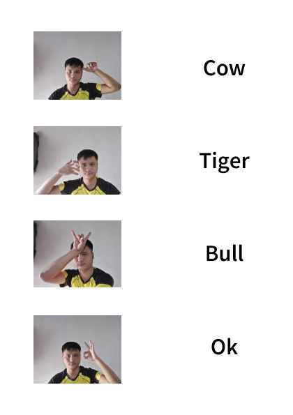

# Animal Hand Sign Detection using Django

## Overview

This project is extended version of "Animal Hand Sign Detection CLI" where I used Python Django framework to implement my trained models efficiently as a web app. The application works totally on a web that captures video input from a webcam, detects hand signs, and outputs the recognized animal name and short introduction when "ok" sign is detected by model in a real-time.

## Features

- Frontend: HTML, CSS, JavaScript (UI and interactions)
- Backend: Django (data handling, model predictions)
- Real-time hand sign detection using webcam.
- Outputs the name and short introduction of the recognized animal when "ok" sign is detected.


## Requirements

It is recommended to use a virtual environment to manage dependencies. Follow these steps:

1. **Create a virtual environment**:
   ```bash
   python -m venv venv
   ```
2. **Activate Virtual Envioronment**
- On Windows
   ```bash
   venv/Scripts/activate
   ```
- On MacOS/Linux
    ```bash
   venv/bin/activate
   ```


## Getting Started

- Clone the Repository
   ```bash
     git clone https://github.com/MekhzZ/Animal_Hand_Sign_Detection_using_Django.git
   ```

- Go to the Directory

   ```bash
     cd Animal_Hand_Sign_Detection_using_Django
   ```

- Install the Required Packages

   ```bash
    pip install -r requirements.txt
   ```

- Migrate the essentials

   ```bash
    python manage.py makemigrations
   ```

  ```bash
    python manage.py migrate
   ```

- Running the Application
      
   ```bash
    python manage.py runserver
   ```

## Hand-Sign Guide


The videos were taken in bright light so, it may not work as expected in dim light.


   


## Contributing

   
Contributions are welcome! If you have suggestions or improvements, feel free to create a pull request.
